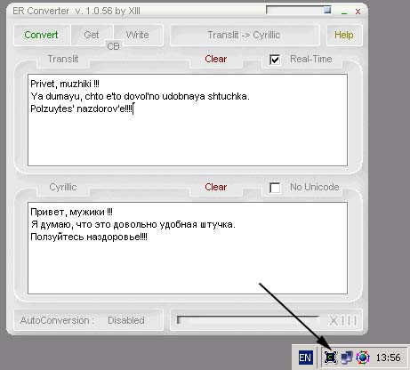



## ER Converter

### Description

ER Converter it is a Translit->Cyrillic->Translit text converter. As I know, it is not so convenient to write Russian text because of the keyboard structure. In addition, many countries do not have Russian keyboards at all.

However, the most important thing is that it is easy to use, just 3 little steps :

1) Copy the text you want to convert ( CTRL+C )

2) Press CTRL+F12

3) Paste converted text wherever you want ( CTRL+V )

That is all.
 
### More Info
 
Translit, English text in the program's window or by writing some text in clipboard and pressing CTRL + F12.

Example : CTRL+C -> CTRL+F12 -> CTRL+V

To run ER Converter in HOT-KEY mode you have to run it with command line argument : ER_Converter.exe HOTKEY

Converted text.

Press “Convert” in the program's window or CTRL+V to retrieve converted result from clipboard.

None, as I know.

             |
---                |---
**Submitted On**   |2002-05-08 13:48:00
**By**             |[Alexander Kossovsky](https://github.com/Planet-Source-Code/PSCIndex/blob/master/ByAuthor/alexander-kossovsky.md)
**Level**          |Advanced
**User Rating**    |4.7 (47 globes from 10 users)
**Compatibility**  |VB 5\.0, VB 6\.0
**Category**       |[Complete Applications](https://github.com/Planet-Source-Code/PSCIndex/blob/master/ByCategory/complete-applications__1-27.md)
**World**          |[Visual Basic](https://github.com/Planet-Source-Code/PSCIndex/blob/master/ByWorld/visual-basic.md)
**Archive File**   |[ER\_Convert80702582002\.zip](https://github.com/Planet-Source-Code/alexander-kossovsky-er-converter__1-34557/archive/master.zip)

